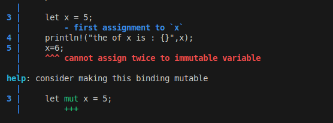
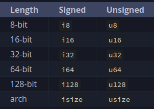

# Rust Learning Documentation

## Resources
- **Rust Book**: [Rust Programming Language Book](https://doc.rust-lang.org/stable/book/)

## Compiling and Running Code
- **To compile the code**:
    ```sh
    rustc filename.rs
    ```
- **To run the compiled code**:
    ```sh
    ./filename
    ```

## Cargo Commands
- **Check Cargo version**:
    ```sh
    cargo --version
    ```
- **Create a new Cargo package**:
    ```sh
    cargo new helloWorld
    ```
- **Build the project**:
    ```sh
    cargo build
    ```
- **Run the project**:
    ```sh
    cargo run
    ```

## Rust Concepts

### Variables



- You can't mutate a constant.

#### Shadowing
```rust
let x = 5;
println!("The value of x is: {}", x);
let x = 6;
println!("The value of x is: {}", x);
```


## Scalar Data Types

Scalar data types refer to data types that can represent a single value. In programming, these are fundamental building blocks for data manipulation. Below are the main scalar data types:

### Integer Types
Integers represent whole numbers, both positive and negative. They are typically used when you need to count items or perform arithmetic operations that do not require precision.



### Floating-Point Numbers
Floating-point numbers represent real numbers, including both integers and fractions. They are used when you need to perform calculations requiring precision, such as scientific computations.

### Booleans
Booleans represent truth values, typically `true` or `false`. They are essential for control flow in programming, enabling conditional execution of code based on logical conditions.

### Characters
Characters represent individual symbols, such as letters, digits, and punctuation marks. They are often used in text processing and manipulation.

## Functions

Functions are fundamental units of code in programming, allowing for reusable and modular code. They can be categorized based on their return behavior:

### Expressions
Expressions are functions that return a value. They are evaluated and produce a result, which can be used in further computations or assignments.

### Statements
Statements are functions or blocks of code that do not return a value. They perform actions, such as altering the flow of control, without producing a result that can be directly used in computations.
